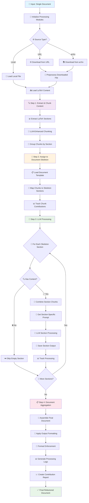

# 🔧 DOCUMENT REFACTORING FLOWCHART

## 📋 Overview
This flowchart details the **single document refactoring** process that transforms unstructured documents into professionally formatted, well-organized academic papers using LLM intelligence.

---

## 🎯 REFACTORING PROCESS FLOW



---

## 🔍 DETAILED STEP BREAKDOWN

### 📥 **Input Processing & Loading**

#### Source Handling
```
🌐 URL Sources:
├── 🔗 HTTP/HTTPS URLs
├── 📥 Download with TexDownloader
├── 🧹 Preprocess content
└── 📄 Extract LaTeX structure

📚 arXiv Sources:
├── 🆔 arXiv ID format (arxiv:2301.12345)
├── 📦 Download source archive
├── 🗂️ Extract main .tex file
└── 🧹 Clean and preprocess

📁 Local Files:
├── 📄 Direct file loading
├── 🔍 UTF-8 encoding support
├── ✅ File existence validation
└── 📊 Content extraction
```

### 🔍 **Step 1: Content Extraction & Chunking**

#### 1.1 LaTeX Section Extraction
```
🔍 extract_latex_sections():
├── 📋 Regex Pattern Matching:
│   ├── Comment-based sections: % --- Section ---
│   ├── LaTeX environments: \begin{...} \end{...}
│   └── Bibliography: \begin{thebibliography}
├── 📊 Content Parsing:
│   ├── Tables with labels preserved
│   ├── Equations maintained intact
│   ├── Figures and graphics preserved
│   └── Text paragraphs segmented
└── 🏷️ Metadata Assignment:
    ├── Content type classification
    ├── Parent section tracking
    └── Chunk identification
```

#### 1.2 LLM-Enhanced Chunking
```
🧠 llm_enhance_chunking():
├── 🎯 Content Type Classification:
│   ├── LLM analyzes chunk content
│   ├── Classifies: equation, table, figure, text
│   └── Assigns appropriate processing strategy
├── 🔗 Dependency Analysis:
│   ├── Identifies content relationships
│   ├── Groups related chunks
│   └── Maintains logical connections
├── 🔄 Intelligent Merging:
│   ├── LLM decides merge candidates
│   ├── Combines semantically related content
│   └── Optimizes chunk boundaries
└── 📊 Boundary Optimization:
    ├── Semantic chunk boundaries
    ├── Natural break point detection
    └── Content coherence preservation
```

#### 1.3 Section Grouping
```
📂 group_chunks_by_section():
├── 📋 Organization by parent section
├── 🔄 Maintains chunk order within sections
├── 📊 Creates section-based dictionary
└── 🎯 Prepares for skeleton mapping
```

### 🎯 **Step 2: Document Skeleton Assignment**

#### 2.1 Template Loading
```
📋 Document Templates:
├── 🎓 Academic Paper Template:
│   ├── Abstract, Introduction, Methods
│   ├── Results, Discussion, Conclusion
│   └── References, Appendices
├── 📄 Bitcoin Paper Template:
│   ├── Abstract, Introduction, Transactions
│   ├── Proof-of-Work, Network, Privacy
│   └── Calculations, Conclusion
└── 🔧 Custom Templates:
    ├── User-defined structures
    ├── Domain-specific layouts
    └── Flexible section definitions
```

#### 2.2 Chunk-to-Skeleton Mapping
```
🔄 assign_chunks_to_skeleton():
├── 📊 Section Matching Logic:
│   ├── Keyword-based initial matching
│   ├── Content similarity analysis
│   └── Structural pattern recognition
├── 🎯 Special Section Handling:
│   ├── Summary: Gets all content overview
│   ├── Assumptions: Comprehensive analysis
│   └── Standard sections: Direct mapping
├── 📈 Content Aggregation:
│   ├── Multiple chunks per skeleton section
│   ├── Content combination strategies
│   └── Redundancy elimination
└── 📊 Assignment Tracking:
    ├── Source-to-target mapping
    ├── Content contribution analysis
    └── Processing decision logging
```

### 🧠 **Step 3: LLM Processing**

#### 3.1 Section-Specific Processing
```
🎯 For Each Skeleton Section:
├── 📄 Content Preparation:
│   ├── Combine assigned chunks
│   ├── Preserve formatting and structure
│   └── Maintain technical accuracy
├── 🎯 Prompt Engineering:
│   ├── Section-specific instructions
│   ├── Academic writing guidelines
│   ├── Technical accuracy requirements
│   └── Format compliance rules
├── 🧠 LLM Processing:
│   ├── Contextual processing with document memory
│   ├── Section-aware content generation
│   ├── Technical term consistency
│   └── Professional tone maintenance
└── 💾 Output Management:
    ├── Individual section files
    ├── Processing metadata
    └── Quality validation
```

#### 3.2 Contextual LLM Handler
```
🧠 ContextualLLMHandler Features:
├── 📚 Document Context Management:
│   ├── Maintains processing history
│   ├── Tracks section relationships
│   └── Ensures consistency across sections
├── 🎯 Section Context Tracking:
│   ├── Section-specific memory
│   ├── Content evolution tracking
│   └── Reference consistency
├── 🎨 Format Enforcement:
│   ├── LaTeX compliance validation
│   ├── Academic writing standards
│   └── Technical formatting rules
└── 🔄 Adaptive Processing:
    ├── Content-aware prompt adaptation
    ├── Quality-based refinement
    └── Error recovery strategies
```

### 📋 **Step 4: Document Aggregation**

#### 4.1 Document Assembly
```
📄 aggregate_document():
├── 📋 Document Structure:
│   ├── LaTeX document class and packages
│   ├── Title, author, and metadata
│   └── Professional document header
├── 📊 Section Ordering:
│   ├── Logical academic progression
│   ├── Template-defined sequence
│   └── Content flow optimization
├── 🎨 Content Integration:
│   ├── Section content insertion
│   ├── Proper LaTeX formatting
│   └── Cross-reference handling
└── 🧹 Final Cleanup:
    ├── Formatting consistency
    ├── Reference validation
    └── Compilation readiness
```

#### 4.2 Output Formatting
```
🎨 OutputFormatter:
├── 📄 LaTeX Format:
│   ├── Academic paper structure
│   ├── Proper sectioning commands
│   └── Mathematical notation support
├── 📝 Markdown Format:
│   ├── Web-friendly formatting
│   ├── Documentation standards
│   └── Platform compatibility
├── 📊 JSON Format:
│   ├── Structured data output
│   ├── API-friendly format
│   └── Processing metadata
└── 🔧 Custom Formats:
    ├── User-defined templates
    ├── Domain-specific requirements
    └── Integration compatibility
```

---

## 🎯 KEY PROCESSING STRATEGIES

### 🧠 **LLM Integration Points**

#### Content Type Classification
```
🎯 LLM Analysis:
├── 📊 Content categorization
├── 🔍 Technical complexity assessment
├── 📝 Writing style adaptation
└── 🎨 Format requirement determination
```

#### Semantic Chunking
```
🧠 Boundary Detection:
├── 📄 Natural paragraph breaks
├── 🔗 Logical content transitions
├── 📊 Topic shift identification
└── 🎯 Coherence optimization
```

#### Section Processing
```
🎯 Contextual Enhancement:
├── 📚 Document-wide consistency
├── 🔗 Cross-section references
├── 📊 Technical term standardization
└── 🎨 Professional tone maintenance
```

### 📊 **Quality Assurance**

#### Format Enforcement
```
🎨 FormatEnforcer:
├── 📋 LaTeX compliance validation
├── 🔧 Automatic error correction
├── ⚠️ Issue identification and reporting
└── ✅ Compilation readiness verification
```

#### Content Validation
```
🔍 Quality Checks:
├── 📄 Content completeness
├── 🔗 Reference consistency
├── 📊 Technical accuracy
└── 🎯 Academic standards compliance
```

---

## 📈 PROCESSING METRICS

### 📊 **Performance Indicators**
- **Chunks Extracted**: Total content segments identified
- **Enhancement Rate**: % of chunks improved by LLM
- **Section Coverage**: % of skeleton sections populated
- **Processing Success**: % of sections successfully processed
- **Format Compliance**: % of output meeting standards

### 🎯 **Quality Measures**
- **Content Preservation**: Original information retention
- **Structure Improvement**: Organization enhancement
- **Academic Standards**: Professional formatting compliance
- **Technical Accuracy**: Specialized content handling
- **Compilation Success**: LaTeX processing readiness

---

## 🚀 **ADVANCED FEATURES**

### 🧠 **Intelligent Processing**
- **Context Awareness**: Document-wide memory and consistency
- **Adaptive Prompting**: Content-specific LLM instructions
- **Multi-pass Processing**: Analysis, processing, and refinement
- **Quality Optimization**: Iterative improvement strategies

### 📊 **Comprehensive Tracking**
- **Contribution Analysis**: Source-to-output mapping
- **Processing Logs**: Detailed operation history
- **Quality Metrics**: Performance and accuracy measures
- **Debug Information**: Troubleshooting and optimization data

### 🎨 **Professional Output**
- **Multiple Formats**: LaTeX, Markdown, JSON support
- **Academic Standards**: Professional document formatting
- **Technical Accuracy**: Specialized content handling
- **Compilation Ready**: Error-free LaTeX output

This system transforms **unstructured documents** into **professionally formatted academic papers** with **intelligent content organization** and **LLM-enhanced quality**! 🌟